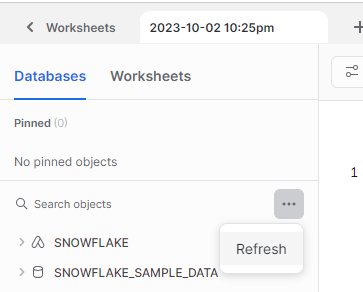

# Snowflake - Introduction Course (COURSERA)

[Notion Version](https://www.notion.so/Snowflake-Introduction-Course-COURSERA-988f2beedf5f4921a26f7bd9dc691a1e) 

Snowflake is one of the most innovative and popular data warehousing solutions in the market.

[CLICK HERE TO SEE AN UP TO DATE GUIDE](https://docs.snowflake.com/)

## Access

There are 2 methods to access to our account:

1. Direct URL:  Check the email “Activate your Snowflake Account” sent to you, and use the link
2. Go to https://app.snowflake.com. It will request for your account name, you can find it as part of the URL in step 1

### Snowflake interface and shortcuts

- Section Worksheets: here you will ride all of your SQL commands, and execute all of your queries.
    - in the + button you can create a new worksheet, either in Python or SQL
- CTRL+ ENTER: Run the code
- If you add a new database, you will have to refresh the database area by clicking on the three dots and then Refresh
    
    
    
- Those are the schemas of the database. A **schema** is just like a container or a folder that holds different database objects, so this just helps with structuring our database.
    
    
    
- Inside the Schemas there are tables.
- To enter the name of the table go to the three dots next to the table, and select “place name in editor”
    
    
    
- A **fully qualified table name** means we have:
    
    ```sql
    *NameOfDatabase*.*NameOfSchema*.*NameOfTable* ##Fully qualified table name
    ```
    
- A **warehouse** is basically just the compute power that we use to execute all of our queries. **You need to have an active warehouse selected to execute a query because this provides the compute power that is needed to execute the query**

### Key concepts

The key thing about Snowflake is that the compute power is decoupled from the data storage. This means that when we have some data in a database, the data is not stored actually in Snowflake, It is stored in an external Cloud provider.


- STORAGE: In our case, we have chosen AWS and therefore the data will be compressed into so-called **blobs**. A Blob is a very efficient data compression so the data is very efficiently stored and then we use that data from those S3 buckets. This is what we call **hybrid columnar storage**, a very modern way of storing data and it is used and very helpful in data warehouses because with data warehouses, we rely on having a high performance when querying the data. We need to get the data very quickly out of that database to see those roles and to work with those roles. For transactional databases (when we need to store, change, and modify the data) the data is usually stored in rows. But when we want to get the data with a high performance out of the warehouse or out of the database it is much more efficient to use columnar storage so the data is stored in columns.
- QUERY PROCESSING: This is also referred to as the muscle of the system because this is where our compute power is coming from. This is where we have our so-called virtual warehouses. We have **server nodes** that give us the compute power to execute the queries to retrieve (recuperate) the data. They are referred to as the warehouses. In Snowflake they can also perform the so-called **massive parallel processing (MMP).** This means that if we have a very complex query that usually takes a lot of time, this query can be broken down into different parts of the query and then we have multiple servers or multiple warehouses that can execute those different parts in parallel. Like this again, we have a much better performance.
- CLOUD SERVICES: The last layer. This is the brain of the system because here, all of the services, all of the layers that we don’t see come together. this is where all of the metadata is stored, all of the security is managed, and all of this is happening in the Cloud Service.

## UNDERSTANDING WAREHOUSES

warehouse = server.

A warehouse is a virtual compute cluster that provides the compute resources to execute queries

When we set up a warehouse we’ll see that we have different warehouse sizes. There are 4 relevant factors that should be considered when determining an appropriate warehouse size:

- Budget. Larger warehouses are more expensive.
- Query complexity: The size of your warehouse should be able to handle the complexity of the queries you plan to run. Large data sets or more complex queries need a larger warehouse.
- Data Volume: A large amount of data requires a large warehouse to process it efficiently.
- Performance requirements: If you need faster query response times, you’ll need a larger warehouse to handle the workload.

The sizes are:

- XS: we have 1 server that is used for the compute power. Ideal for a simple queries that are processed very quickly
- S: we have 2 servers that are used for the compute power
- M: we have 4 servers that are used for the compute power
- L: we have 8 servers that are used for the compute power
- XL: we have 16 servers that are used for the compute power
- 4XL: we have 128 servers that are used for the compute power.

The more server you have the more you will get:

- more compute power and a faster query processing
- The more complex our queries are the faster results.
- Better user experience.
- More credits consumed

A warehouse is also usually created for a specific purpose. This purpose can be specified in the comments.

### Payment

We transform Euros or US dollars into credits. Those credits is what is consumed by those warehouses.

1 Warehouse = 1 credit per hour in XS size (this is built even by seconds).

How expensive the credits are depends on the version that we are using. In our case, we use the **business critical**, which is the most expensive one.


### Multi-Clustering

Malti-cluster warehouse is scaling out. Increasing the size of a given warehouse is scaling up.

A multi-cluster warehouse (scale out) is a **feature** that will add additional clusters of warehouses to our main warehouse (we can use it with at least the enterprise version). This is very useful when we have a lot of users creating many queries. It prevents the queries from being queued up and waiting very long, being processed by the different clustered warehouses.

The benefits are:

- The user experience gets better.
- We can have this as an auto-scaling feature, so whenever there are enough queries queued up, this will be also started, and then we will start additional clusters of warehouses.

### Scaling policy

This is to define when to start an additional cluster.

- Standard: This is the default one. Favors additional warehouses, so we don’t favor saving on costs, but whenever there’s a queue, we will start a new warehouse cluster.
- Economy: More conservative economic policy which favors conserving credits rather than starting additional warehouses or better performance.


### Set up a Warehouse

There are 2 ways of doing it:

1. By using SQL commands and just executing those commands in the worksheet.
    
    ```sql
    CREATE WAREHOUSE *WarehouseName*
    WITH  #after WITH we can specify the different properties of the warehouse
    WAREHOUSE_SIZE = XSMALL #It is mandatory to specify the size of the warehouse
    MAX_CLUSTER_COUNT = 3 #Maximum amount of clusters. If you don't specify it, it will use the default (1)
    MIN_CLUSTER_CPUNT = 2 #Minimum amount of clusters. If you don't specify it, it will use the default (1)
    AUTO_SUSPEND = 60 #After how many seconds without use it should be suspended.
    AUTO_RESUME = TRUE #This is the default value, you don't have to specify it.
    INITIALLY_SUSPENDED = FALSE #This is the original value. It means that it will start to use the warehouse automatically
    COMMENT = '*Type here your comment*' #The purpose of creating this warehouse. This is good practice.
    ```
    
    
    
2. Using the interface:
    1. Main page > Admin section > Warehouses
    
    
    
    b. We can leave advanced options like that. Auto suspend is very important because it will suspend the use of the warehouse automatically when you don’t use it so it doesn’t charge.
    
    
    
    c. Multi-cluster should be selected to enable multi-clustering.
    
    
    
    c. Scaling Policy is just where we can set some compromise between cost and how quickly a new cluster will be started.
    
    
    
    d. Now just click on the warehouse you created
    


You can also modify your warehouse, just use the same command shown before, but using:

```sql
CREATE OR REPLACE WAREHOUSE *WarehouseName
...*
```

If the warehouse already exists, it will be replaced.

When we create a warehouse with SQL it is automatically being used and per default already started.

We can also drop a warehouse

```sql
DROP WAREHOUSE *WarehouseName*
```

## DATABASE OBJECTS


- Databases
- Schemas
    - Information_schema (default)
    - Public (default)
    - …
- Tables
    - Standard: this option will prompt you to an SQL command where you create the columns, their values, and rows.
    - External
    - As selected
- Stage: A Snowflake stage is a location in cloud storage that you use to load and unload data from a table. It contains the location of data files that we can load. Snowflake supports:
    - Internal stages—Used to store data files internally within Snowflake. Each user and table in Snowflake gets an internal stage by default for staging data files.
    - External stages—Used to store data files externally in Amazon S3, Google Cloud Storage, Microsoft Azure, or an external cloud provider. If your data is already stored in these cloud storage services, you can use an external stage to load data in Snowflake tables
        - Additional costs may apply if the region or the Cloud provider is different that we want to load the data from then what we have set in our snowflake account.
- File format: you need this to load the data in a table. It describes a set of staged data to access or load into Snowflake tables.
- Storage integrations: it is use to store credentials in a more secure way.
    
    
    

## LOADING DATA

We distinguish between two different methods of data loading:

- BULK LOADING (we will focus on this one):
    - It is the most important and most frequently used method.
    - Uses warehouses. We do this by loading data from stages (for example with S3 buckets)
    - We load the data using the COPY command. And we can also transform it
- CONTINUOUS LOADING:
    - Designed to load small volumes of data.
    - The data can be loaded automatically once they are added to stages.
    - Latest results for analysis. We rely on the fact that the data is up to date.
    - We don’t use our warehouses, we use snowpipe (serverless feature)

### 1. Loading the data in a stage

We create the stage at the same time we put the data inside (in this case, it will be an external Amazon S3 stage):


You can also create it using SQL (whenever we want to list files from a stage or query and load data from a stage we need to refer to the stage using the @ symbol):


Then we can modify the properties (URL, credentials, file_format,…) using the ALTER SQL command:

```sql
ALTER STAGE *StageName*
SET *PropertyName* = *NewValue*
#If you want to remove a properties (for example, credentials) you can use 
#CREATE AND REPLACE *StageName* command
```

you can use the LIST command to see what is inside the stage

```sql
LIST @*StageName*
```

### 2. Create table

Something important to keep in mind when we create a table:

- the columns should be similar to the columns in the data. It is not important that the column name is exactly the same, but the type of the data needs to match
- The number of columns needs to match the number of columns inside the data file

```sql
CREATE OR REPLACE TABLE NameOfTable (
	"ColumnName1" Type1, #double quotes are optional, but if we don’t use them, all letters will be interpreted as uppercase
	"ColumnName2" Type2 
)
```

Here are some examples:


- You can also specify in the SQL command the Database name, Schema, and table name when you create it. In the next example, we create a table inside OUR_FIRST_DB database:
    
    
    
    
    

Here the table exists, but there is no data included.

### 4. Create a file format.

We create the file format in the database where we store all of our administrative objects.

You can create it by going inside the database, then the schema


Or using SQL commands. Here are some examples:


The file format has some properties, like:

- field_delimiter: what separates the information of one row from one column to the other one.
- Skip_header: here we specify if the data has a header. The default is 0, and 1 means that has a header, so when the data is copied it will use the first row as the header.

We can also modify the properties using the ALTER statement

```sql
ALTER FILE FORMAT *FormatName*
	SET *PropertyName* = *NewValue*
```

### 3. Load data from an external stage into the table using COPY INTO

1. First, we should list the file inside the stage to be sure which information we will load, since every stage can have different files.

```sql
LIST @*DBName.SchemaName.StageName*
```

1. Now we have to specify which file should be loaded because otherwise, it will load all of the files as a default. We do this by mentioning the property files

We can now load data from an external cloud provider, in our case AWS. We are going to load data from an S3 bucket, which contains just CSV files on our AWS account.

We use the next code to load the data:


```sql
COPY INTO *NameOfTable*
FROM @NameOfStage
file_format =  *NameOfFileFormat*
files = ('*NameOfFiles.format*') ##this is the step 2 mentioned before. Here we mention the property file.
```


We can also instead of mentioning the exact file or files, we can mention a pattern. We use wildcards by specifying a dot and then an asterisk and everything that contains the keyword will be loaded.

```sql
COPY INTO *NameOfTable*
FROM @NameOfStage
file_format =  *NameOfFileFormat*
pattern = '.**KeyWord*.*'

```

- If the data has been already loaded, it will not process the same files into the table again.

### Accessing to our data using SQL

We can check the data using different ways:

- Using the fully qualified table name
    
    ```sql
    SELECT * FROM
    *NameOfDatabase*.*NameOfSchema*.*NameOfTable* ##Fully qualified table name
    ```
    
- We can also type only the name of the table, but we have  to make sure that we are selecting the correct context (correct database and schema)
    
    
    
    ```sql
    SELECT * FROM
    *NameOfTable*
    ```
    
- Another option to access to the table:
    
    ```sql
    USE DATABASE *NameOfDatabase*
    SELECT * FROM 
    *NameOfTable*
    ```
    
- Or we can delete all the data in our table:
    
    ```sql
    TRUNCATE TABLE *NameOfTable*
    ```
    

### Good practices

- It’s good to create a database that stores all of our administrative objects (schemas, stages with the data, …).
- We can create a schema inside of the database with the administrative objects that store the external stages.
- It is not a best practice to mention the credentials in the stage object itself. There is another object called storage integration that is just storing those credentials more securely

### Applying transformations during COPY

This is useful so the data can arrive in our database already transformed. There are 3 different ways to do this:

1. Using the SELECT statement to use only a subset of columns
    
    
    
2. Using functions. Note that there are not all of the possible secure functions available, but just a subset of functions we can use in the copy command. Check the supported functions here: [https://docs.snowflake.com/en/user-guide/data-load-transform](https://docs.snowflake.com/en/user-guide/data-load-transform). For the next example, we use CASE, which works like a cascading “if-then-else” statement. In the more general form, a series of conditions are evaluated in sequence. When a condition evaluates to TRUE, the evaluation stops and the associated result (after THEN) is returned. If none of the conditions are evaluated to TRUE, then the result after the optional ELSE is returned, if present; otherwise NULL is returned.
    - The CAST() function converts a value (of any type) into a specified datatype.
    
    
    
3. Using the function substring of a column.
    
    ```sql
    SUBSTR(C*olumnName,StartCharacterPosition,length)*
    ```
    

## COPY OPTIONS

These are just options that we can modify. There are a few different parameters and they all take some default values if we don’t specify them. We add these copy options at the end of the COPY command.

### Copy option: ON_ERROR

The default option is:

```sql
ON_ERROR = 'ABORT_STATEMENT'
```

This means once an error occurs the entire copy command will be stopped and no data will be loaded.

We can specify how we should deal with errors in our copy command. If, for example, we type at the end of our copy command 

```sql
ON_ERROR = 'CONTINUE'
```

When we load the data we will see the status as PARTIALLY_LOADED if it resulted in an error, a column specifying the number of rows parsed (rows_parsed), and another column saying how many rows were successfully loaded (rows_loaded) and more additional information that helps you identify the error.


Otra opción que puedes usar cuando estas cargando muchos archivos al mismo tiempo es:

```sql
ON_ERROR = 'SKIP_FILE' 
```

This will skip the file that has some errors but load the other files. Nothing will be loaded from the file with the error. We can also specify the error limit (how many errors do we accept before we skip the file). It can specify with a number or percentage

```sql
ON_ERROR = 'SKIP_FILE_*numberOfError*' 
```